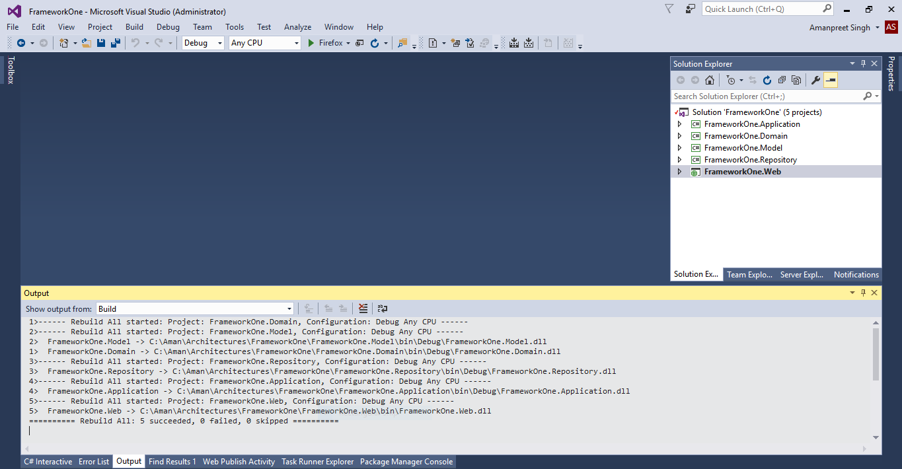

# n-layered Architecture using Entity Framework, Generic Repository and Unit-of-Work #

### Introduction ###

This article covers following things –

- Implementation of n-layered architecture with following layers -
	- Domain layer – holds Entity Framework Context and Entities created using Code First from database approach
	- Repository layer – holds code for CRUD operations using Generic Repository and Unit-of-Work patterns
	- Application layer – holds application logic. Application layer calls methods of Repository layer for CRUD operations. Repository layer returns data in Domain layer Entities. Application layer perform additional logic and returns data in Model objects to the Web layer
	- Model layer – Model is shared between Application and Web layer. Application layer returns data in Model objects to the Web layer
	- Web layer -  This uses MVC (Model-View-Controller) pattern and holds the presentation layer logic. For Models, it uses Model layer objects
- Creating Database for tutorial
- Using Entity Framework’s Code First from database approach
- Using Generic Repository and Unit-of-Work patterns

### Basic Solution and Project creation ###

- Create a new .Net Framework 4.5 Blank Solution (FrameworkOne)
	

- Add a .Net Framework 4.5 Class Library project (FrameworkOne.Repository) in the solution
	

- Add a .Net Framework 4.5 Class Library project (FrameworkOne.Domain) in the solution
 	

- Add a .Net Framework 4.5 Class Library project (FrameworkOne.Application) in the solution
 	

- Add a .Net Framework 4.5 Class Library project (FrameworkOne.Model) in the solution
  	

- Add a .Net Framework 4.5 ASP.NET Web Application project (FrameworkOne.Web) in the solution
  	

- Select MVC template

  	

### Adding NuGet Packages ###

- Using NuGet Package Manager, add Entity Framework in FrameworkOne.Domain project
  	

- Using NuGet Package Manager, add Entity Framework in FrameworkOne.Repository project
  	

- Using NuGet Package Manager, add Unity.Mvc in FrameworkOne.Web project. This is added for Dependency Injection
  	

### Adding Project References ###

- Add Framework.Domain project reference in FrameworkOne.Repository project
  	

- Add FrameworkOne.Domain, FrameworkOne.Model, Framework.Repository project reference in FrameworkOne.Application project
  	

- Add FrameworkOne.Application, FrameworkOne.Domain, FrameworkOne.Model, Framework.Repository project reference in FrameworkOne.Web project
  	

### Setting up the Database ###

- Connect to (localdb)\MSSQLLocalDb server from SQL Server 2014 Management Studio
  	

- Create a new Database (FrameworkOne) with default settings
  	

- Create three tables Student, Assignment, StudentAssignment. Below is the Database diagram and CREATE scripts for three tables

  	

	>     /****** Object:  Table [dbo].[Student] ******/
	>     USE [FrameworkOne]
	>     GO
	>     
	>     SET ANSI_NULLS ON
	>     GO
	>     
	>     SET QUOTED_IDENTIFIER ON
	>     GO
	>     
	>     CREATE TABLE [dbo].[Student](
	>     	[StudentId] [int] NOT NULL,
	>     	[Name] [nvarchar](100) NOT NULL,
	>      CONSTRAINT [PK_Employee] PRIMARY KEY CLUSTERED 
	>     (
	>     	[StudentId] ASC
	>     )WITH (PAD_INDEX = OFF, STATISTICS_NORECOMPUTE = OFF, IGNORE_DUP_KEY = OFF, ALLOW_ROW_LOCKS = ON, ALLOW_PAGE_LOCKS = ON) ON [PRIMARY]
	>     ) ON [PRIMARY]
	>     
	>     GO
	>     
	>     /****** Object:  Table [dbo].[Assignment] ******/
	>     USE [FrameworkOne]
	>     GO
	>     
	>     SET ANSI_NULLS ON
	>     GO
	>     
	>     SET QUOTED_IDENTIFIER ON
	>     GO
	>     
	>     CREATE TABLE [dbo].[Assignment](
	>     	[AssignmentId] [int] NOT NULL,
	>     	[Name] [nvarchar](100) NOT NULL,
	>     	[TotalMarks] [int] NOT NULL,
	>      CONSTRAINT [PK_Assignment] PRIMARY KEY CLUSTERED 
	>     (
	>     	[AssignmentId] ASC
	>     )WITH (PAD_INDEX = OFF, STATISTICS_NORECOMPUTE = OFF, IGNORE_DUP_KEY = OFF, ALLOW_ROW_LOCKS = ON, ALLOW_PAGE_LOCKS = ON) ON [PRIMARY]
	>     ) ON [PRIMARY]
	>     
	>     GO
	>     
	>     /****** Object:  Table [dbo].[StudentAssignment] ******/
	>     USE [FrameworkOne]
	>     GO
	>     
	>     SET ANSI_NULLS ON
	>     GO
	>     
	>     SET QUOTED_IDENTIFIER ON
	>     GO
	>     
	>     CREATE TABLE [dbo].[StudentAssignment](
	>     	[StudentId] [int] NOT NULL,
	>     	[AssignmentId] [int] NOT NULL,
	>     	[Marks] [float] NULL,
	>      CONSTRAINT [PK_EmployeeAssignment] PRIMARY KEY CLUSTERED 
	>     (
	>     	[StudentId] ASC,
	>     	[AssignmentId] ASC
	>     )WITH (PAD_INDEX = OFF, STATISTICS_NORECOMPUTE = OFF, IGNORE_DUP_KEY = OFF, ALLOW_ROW_LOCKS = ON, ALLOW_PAGE_LOCKS = ON) ON [PRIMARY]
	>     ) ON [PRIMARY]
	>     
	>     GO
	>     
	>     ALTER TABLE [dbo].[StudentAssignment]  WITH CHECK ADD  CONSTRAINT [FK_EmployeeAssignment_Assignment1] FOREIGN KEY([AssignmentId])
	>     REFERENCES [dbo].[Assignment] ([AssignmentId])
	>     GO
	>     
	>     ALTER TABLE [dbo].[StudentAssignment] CHECK CONSTRAINT [FK_EmployeeAssignment_Assignment1]
	>     GO
	>     
	>     ALTER TABLE [dbo].[StudentAssignment]  WITH CHECK ADD  CONSTRAINT [FK_EmployeeAssignment_Employee1] FOREIGN KEY([StudentId])
	>     REFERENCES [dbo].[Student] ([StudentId])
	>     GO
	>     
	>     ALTER TABLE [dbo].[StudentAssignment] CHECK CONSTRAINT [FK_EmployeeAssignment_Employee1]
	>     GO

- Insert some data in three table Student, Assignment, StudentAssignment
	>     SELECT [StudentId] ,[Name] FROM [FrameworkOne].[dbo].[Student]

  	

	>     SELECT [AssignmentId], [Name], [TotalMarks] FROM [FrameworkOne].[dbo].[Assignment]
  	
	

	>     SELECT [StudentId], [AssignmentId], [Marks] FROM [FrameworkOne].[dbo].[StudentAssignment]

	

### Adding Entity Framework ###

- In FrameworkOne.Domain project add ADO.Net Entity Data Model (FrameworkOneContext)
	

- Select Code First from database option

	

- From Choose Your Data Connection screen, create connection string to FrameworkOne database and save as FrameworkOneContext

	

- From Choose Your Database Objects and Settings, select Student, Assignment, StudentAssignment tables
	

- FrameworkOne.Domain project looks like this

	

### Creating Generic Repository and Unit of Work ###

- In FrameworkOne.Repository project, first add folder Interface. Then add a new interface file IGenericRepository.cs
	

- IGenericRepository interface will look like this
	>     namespace FrameworkOne.Repository.Interface
	>     {
	>         public interface IGenericRepository<T> where T : class
	>         {
	>         }
	>     }

- Add four methods to IGenericRepository interface – GetItem, Insert, Update, Delete
	>     namespace FrameworkOne.Repository.Interface
	>     {
	>         public interface IGenericRepository<T> where T : class
	>         {
	>             IQueryable<T> GetAll();
	>     
	>             void Insert(T entity);
	>     
	>             void Update(T entity);
	>     
	>             void Delete(T entity);
	>         }
	>     }

- In FrameworkOne.Repository project, add a class file GenericRepository
	

- Implement IGenericRepository interface in GenericRepository class
	>     namespace FrameworkOne.Repository
	>     {
	>         public class GenericRepository<T> : IGenericRepository<T> where T : class
	>         {
	>             public IQueryable<T> GetAll()
	>             {
	>                 throw new NotImplementedException();
	>             }
	>     
	>             public void Insert(T entity)
	>             {
	>                 throw new NotImplementedException();
	>             }
	>     
	>             public void Update(T entity)
	>             {
	>                 throw new NotImplementedException();
	>             }
	>     
	>             public void Delete(T entity)
	>             {
	>                 throw new NotImplementedException();
	>             }
	>     
	>         }
	>     }

- In FrameworkOne.Repository project, add a new interface file IUnitOfWork
	

- Add DbContext property and Save method to IUnitOfWork interface
	>     namespace FrameworkOne.Repository.Interface
	>     {
	>         public interface IUnitOfWork : IDisposable
	>         {
	>             FrameworkOneContext DbContext { get; }
	>     
	>             int Save();Creating Generic Repository and Unit of Work
	>         }
	>     }

- In FrameworkOne.Repository project, add a class file UnitOfWork
	

- Implement IUnitOfWork interface in UnitOfWork class. UnitOfWork looks like this
	>     namespace FrameworkOne.Repository
	>     {
	>         public class UnitOfWork : IUnitOfWork
	>         {
	>             private FrameworkOneContext _context;
	>     
	>             public UnitOfWork(FrameworkOneContext context)
	>             {
	>                 this._context = context;
	>                 this._context.Configuration.LazyLoadingEnabled = false;
	>             }
	>     
	>             public FrameworkOneContext DbContext
	>             {
	>                 get
	>                 {
	>                     return this._context;
	>                 }
	>             }
	>     
	>             public int Save()
	>             {
	>                 return this._context.SaveChanges();
	>             }
	>     
	>             public void Dispose(bool disposing)
	>             {
	>                 if (disposing)
	>                 {
	>                     if (this._context != null)
	>                     {
	>                         this._context.Dispose();
	>                         this._context = null;
	>                     }
	>                 }
	>             }
	>     
	>             public void Dispose()
	>             {
	>                 Dispose(true);
	>                 GC.SuppressFinalize(this);
	>             }
	>         }
	>     }

- GenericRepository class will implement methods from IGenericRepository. GenericRepository looks like this. It has definition for GetAll, Insert, Update, Delete methods
	>     namespace FrameworkOne.Repository
	>     {
	>         public class GenericRepository<T> : IGenericRepository<T> where T : class
	>         {
	>             protected FrameworkOneContext _context;
	>     
	>             public GenericRepository(IUnitOfWork unitOfWork)
	>             {
	>                 _context = unitOfWork.DbContext;
	>             }
	>     
	>             public IQueryable<T> GetAll()
	>             {
	>                 IQueryable<T> query = _context.Set<T>();
	>                 return query;
	>             }
	>     
	>             public void Insert(T entity)
	>             {
	>                 _context.Set<T>().Add(entity);
	>             }
	>     
	>             public void Update(T entity)
	>             {
	>                 _context.Set<T>().Attach(entity);
	>             }
	>     
	>             public void Delete(T entity)
	>             {
	>                 _context.Set<T>().Remove(entity);
	>             }
	>         }
	>     }

- Rebuild the solution

	

### Creating Model classes ###

- In FrameworkOne.Model project, add StudentModel class
	

- StudentModel class have two properties - StudentId and Name
	>     namespace FrameworkOne.Model
	>     {
	>         public class StudentModel
	>         {
	>             public int StudentId { get; set; }
	>     
	>             public string Name { get; set; }
	>         }
	>     }

- In FrameworkOne.Model project, add AssignmentModel class
	

- AssignmentModel class have three properties – AssignmentId, Name, TotallMarks
	>     namespace FrameworkOne.Model
	>     {
	>         public class AssignmentModel
	>         {
	>             public int AssignmentId { get; set; }
	>     
	>             public string Name { get; set; }
	>     
	>             public int TotalMarks { get; set; }
	>         }
	>     }

### Creating Application Logic classes ###

- In FrameworkOne.Application project, add Interface folder

	

- In FrameworkOne.Application, add IStudentLogic interface
	

- IStudentLogic interface have three methods – 
	- GetData method – for fetching data from Repository in Domain classes. It loads the data in Model classes and pass to the Web layer
	- SaveData method – for saving new data
	- Dispose method – for disposing unitofwork object
	>     namespace FrameworkOne.Application.Interface
	>     {
	>         public interface IStudentLogic
	>         {
	>             List<StudentModel> GetData();
	>     
	>             void SaveData(StudentModel studentModel);
	>     
	>             void Dispose();
	>         }
	>     }

- In FrameworkOne.Application, add StudentLogic class
	

- Implement IStudentLogic interface in StudentLogic class
	>     namespace FrameworkOne.Application
	>     {
	>         public class StudentLogic : IStudentLogic
	>         {
	>             public void Dispose()
	>             {
	>                 throw new NotImplementedException();
	>             }
	>     
	>             public List<StudentModel> GetData()
	>             {
	>                 throw new NotImplementedException();
	>             }
	>     
	>             public void SaveData(StudentModel studentModel)
	>             {
	>                 throw new NotImplementedException();
	>             }
	>         }
	>     }

- StudentLogic class have –
	- Constructor: for setting up object references (using DI)
	- GetData method – for fetching data from Repository in Domain classes. It loads the data in Model classes and pass to the Web layer
	- SaveData method – for saving new data
	- Dispose method – for disposing unitofwork object
	>     namespace FrameworkOne.Application
	>     {
	>         public class StudentLogic : IStudentLogic
	>         {
	>             private IUnitOfWork unitOfWork;
	>             private IGenericRepository<Student> studentRepository;
	>     
	>             public StudentLogic(IUnitOfWork unitOfWork, IGenericRepository<Student> studentRepository)
	>             {
	>                 this.unitOfWork = unitOfWork;
	>                 this.studentRepository = studentRepository;
	>             }
	>     
	>             public List<StudentModel> GetData()
	>             {
	>                 List<Student> students = studentRepository.GetAll().ToList();
	>     
	>                 List<StudentModel> studentModels = new List<StudentModel>();
	>                 foreach (Student student in students)
	>                 {
	>                     StudentModel studentModel = new StudentModel()
	>                     {
	>                         StudentId = student.StudentId,
	>                         Name = student.Name
	>                     };
	>     
	>                     studentModels.Add(studentModel);
	>                 }
	>     
	>                 return studentModels;
	>             }
	>     
	>             public void SaveData(StudentModel studentModel)
	>             {
	>                 Student student = new Student() { StudentId = studentModel.StudentId, Name = studentModel.Name };
	>                 studentRepository.Insert(student);
	>     
	>                 this.unitOfWork.Save();
	>             }
	>     
	>             public void Dispose()
	>             {
	>                 this.unitOfWork.Dispose();
	>             }
	>         }
	>     }

### Creating Asp.net MVC Controller classes ###

- Open FrameworkOne.Web project HomeController class
	

- HomeController class is updated to test the overall flow –
	- constructor – for setting up object references (using DI)
	- Index method – modified to test fetching of student data using StudentLogic.GetData method
	- About method – modified to test saving of new student data using Student.SaveData method
	>     namespace FrameworkOne.Web.Controllers
	>     {
	>         public class HomeController : Controller
	>         {
	>             private IStudentLogic studentLogic;
	>     
	>             public HomeController(IStudentLogic studentLogic)
	>             {
	>                 this.studentLogic = studentLogic;
	>             }
	>     
	>             public ActionResult Index()
	>             {
	>                 // Fetch Data
	>                 List<StudentModel> studentModels = studentLogic.GetData();
	>     
	>                 return View();
	>             }
	>     
	>             public ActionResult About()
	>             {
	>                 // Save Data
	>                 StudentModel student = new StudentModel() { StudentId = 100004, Name = "Student Four" };
	>     
	>                 this.studentLogic.SaveData(student);
	>                 this.studentLogic.Dispose();
	>     
	>                 ViewBag.Message = "Your application description page.";
	>     
	>                 return View();
	>             }
	>     
	>             public ActionResult Contact()
	>             {
	>                 ViewBag.Message = "Your contact page.";
	>     
	>                 return View();
	>             }
	>         }
	>     }

- Rebuild the whole solution

	

### Configuration tasks ###
- Copy FrameworkOneContext connectionstring from FrameworkOne.Domain App.config to FrameworkOne.Web web.config

	
	

- Register UnitOfWork, GenericRepository and StudentLogic in FrameworkOne.Web UnityConfig class
	>     public static void RegisterTypes(IUnityContainer container)
	>     {
	>         // NOTE: To load from web.config uncomment the line below. Make sure to add a Microsoft.Practices.Unity.Configuration to the using statements.
	>         // container.LoadConfiguration();
	>     
	>         container.RegisterType<IUnitOfWork, UnitOfWork>(new PerResolveLifetimeManager());
	>         container.RegisterType(typeof(IGenericRepository<>), typeof(GenericRepository<>));
	>         container.RegisterType<IStudentLogic, StudentLogic>();
	>     }

- In FrameworkOne.Domain project FrameworkOneContext class set LazyLoadingEnabled to false in the constructor
	>     public partial class FrameworkOneContext : DbContext
	>     {
	>         public FrameworkOneContext() : base("name=FrameworkOneContext")
	>         {
	>             this.Configuration.LazyLoadingEnabled = false;
	>         }        
	>     }

### Run and Test solution ###

- Put breakpoints on HomeController’s Index and About methods and run the solution

- First Index method will be called. You can see the three rows returned in studentModel variable

- Click on About link at the top. It will save one new row in Student table. Check the database for new row with StudentId – 100004
	>     SELECT [StudentId] ,[Name] FROM [FrameworkOne].[dbo].[Student]
	
